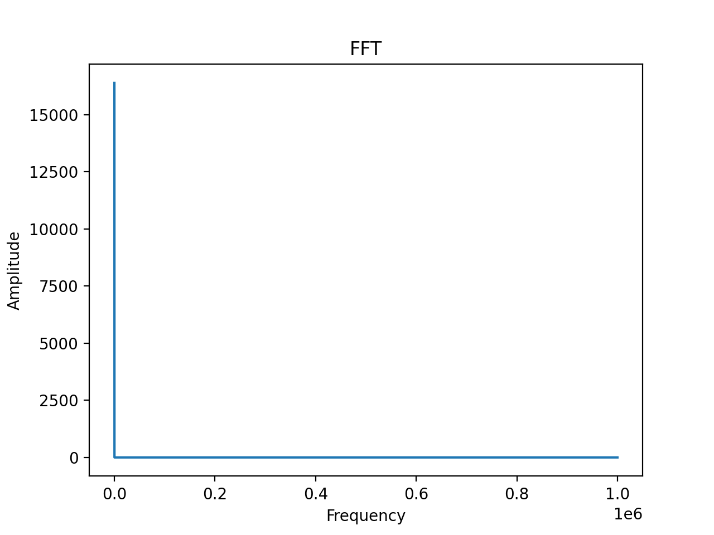
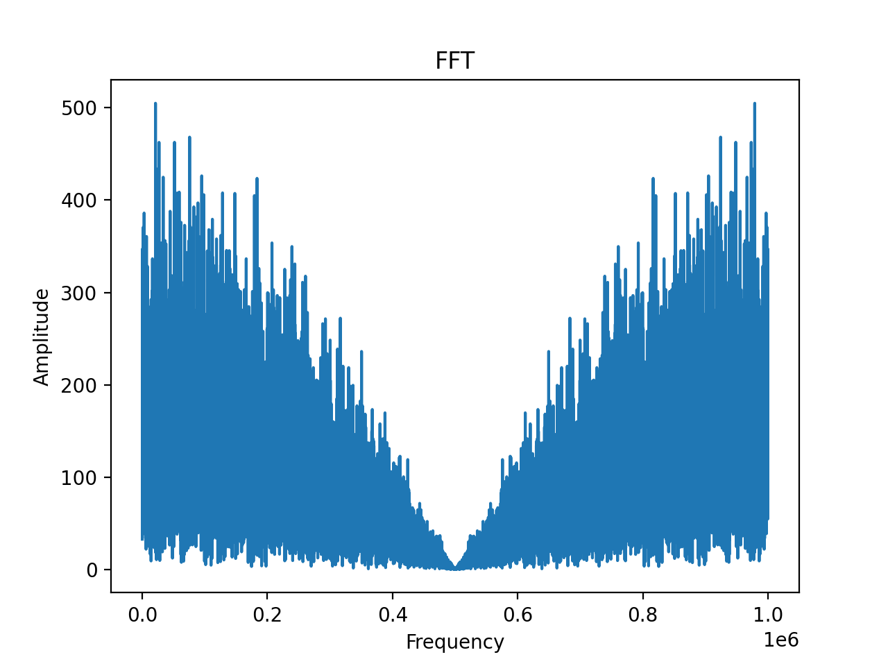

# Execution Environment

User's software runs in a persistent sandboxed execution environment on a Spire payload, which is a specific Linux computer on a satellite controlling specific hardware.  User software is uploaded to this sandbox environment through the Tasking API.  User software has access to it's own filesystem and various software libraries, the specifics of which depend on which payload the customer is scheduling operations on.  The file system is persistent between contacts, files saved to the user's filesystem will persist until they are deleted by the user.

The execution environment includes two top level directories used to manage incoming and outgoing data:

* `/inbox` - Spire generated files during a payload window will be placed into this folder. 
For example, IQ files captures during a PAYLOAD_SDR window will appear in this folder.  File names and types placed in this folder
will vary between window types, please consult the [Tasking API documentation](https://developers.spire.com/tasking-api-docs/) 
for details about a specific window.  Files placed in this folder should be handled during the window which they are generated.
* `/outbox` - Any files placed in this folder by user software will be queued for downlink.  Files placed here will be removed by the Spire Linux Agent after 
any payload window.

## Filesystem

The root filesystem is writable to the user. Common Linux directories have been bind-mounted read-only, i.e. `/bin`, `/usr`, `/proc`, `/var` etc. The user's home directory `~` may not be on the same path for each payload. The Tasking API executes customer applications outside of a shell. For these reasons it recommended to:

1. Create a wrapper shell script to add environment variables
1. Create and use `/persist` or similar directory name at the root of the filesystem
1. Treat all other directories as read-only
1. When installing, install to this directory


## Payload Specifications

Below are the list of specifications for each payload type accessible to Software in Space customers including the list of packages pre-installed on the payload.

## SDR

| Attribute    | Value                               |
| ------------ | ------------------------------------|
| SoC          | Xilinx Zynq UltraScale+ ZU4CG       |
| CPU          | 2x ARM Cortex A53 @ 1.3GHz (+ 2x ARM Cortex R5F @ 533Mhz)	|
| Memory       | 2GB                                 |
| OS           | Yocto Poky 2.5 (Sumo)               |
| Arch         | 64-bit armv8-hardfp	             |
| Kernel       | Linux 4.14.0                        |
| IP Address   | 10.2.1.8                            |
| Package List | [List](./assets/text/sdr_package_list.txt) |
| Utilities    | - [RF Collect](#rf-collect)<br> - [RF Transmit](#rf-transmit)<br> - [IQ Generator](#iq-generator) |
| Windows      | [`PAYLOAD_SDR`](https://developers.spire.com/tasking-api-docs/#payload_sdr-v2) |


## IPI

| Attribute    | Value                               |
| ------------ | ------------------------------------|
| SoC          | Xilinx Zynq UltraScale+ ZU4CG       |
| CPU          | 2x ARM Cortex A53 @ 1.3GHz (+ 2x ARM Cortex R5F @ 533Mhz)	|
| Memory       | 2GB                                 |
| OS           | Yocto Poky 2.5 (Sumo)               |
| Arch         | 64-bit armv8-hardfp	             |
| Kernel       | Linux 4.14.0                        |
| IP Address   | 10.2.1.16                            |
| Package List | [List](./text/ipi_package_list.txt) |
| Windows      | [`PAYLOAD_IPI`](https://developers.spire.com/tasking-api-docs/#payload_ipi) |


## Sabertooth

| Attribute    | Value                               |
| ------------ | ------------------------------------|
| SoC          | NVIDIA Tegra TX2i                   |
| CPU          | 4x ARM Cortex A57 @ 2GHz (+ 2x Denver 2 @ 2Ghz) |
| Memory       | 8GB                                 |
| OS           | Ubuntu 18.04.2 ([Jetpack 4.2.2](https://developer.nvidia.com/jetpack-422-archive)) |
| Arch         | 64-bit armv8-hardfp	             |
| Kernel       | Linux 4.9.140                       |
| IP Address   | 10.2.1.10                           |
| Package List | [List](./assets/text/sabertooth_package_list.txt) |
| Windows      | [`PAYLOAD_SABERTOOTH`](https://developers.spire.com/tasking-api-docs/#compute-boards) |


## Dexter

| Attribute    | Value                               |
| ------------ | ------------------------------------|
| SoC          | Xilinx Zynq 7020                    |
| CPU          | 2x ARM Cortex A9 @ 866MHz	         |
| Memory       | 1GB                                 |
| OS           | Yocto Poky 2.3 (Pyro)               |
| Arch         | 32-bit armv7-hardfp	             |
| Kernel       | Linux 4.6.0-2016_R2                 |
| IP Address   | 10.2.1.9                            |
| Package List | [List](./assets/text/dexter_package_list.txt) |


## Tools & Utilities
The following tools and utilities are developed and supported by Spire, and provided on the applicable payload(s) for
customers to run directly or indirectly within a payload windows [`user_command`](/tasking-api-docs/index.html#user_command) parameter.


### RF Collect

```shell
rfcollect
  -w <file>        IQ file to receive
  -S <start>       Start UTC time of the capture in s, 0 will directly starts (default=0s)
  -d <duration>    Duration of the capture in s, (default=10s)
  -f <freq>        Set frequency RX Hz (default=2022500000Hz)
  -g <gain>        Set RX gain dB (range -3dB to 70dB, default=70dB)
  -s <fs>          Set RX sample rate Hz (default=1000000Hz)
  -b <bdw>         Set RX bandwidth Hz (default=1000000Hz)
  -m <band>        SBAND|UHF (default=SBAND)
  -o               Print the logging on stdout instead in file (/var/log/rfcollect.log).
  -l <lvl>         Set log level DEBUG=0, INFO=1, WARN=2, ERR=3, NONE=4 (default=1).
  -h               Help

  NOTE: The capture IQ file size is limited to 1024 MB
```

Payloads: `SDR`

Chroot friendly command to collect raw IQ files (`int16` format). When executing `RFCollect`,
the IQ is captured from the indicated UTC start (`-S`) time for the required duration (`-d`)
period. Then it is written in the indicated output file (`-w`). The output file size is limited to 1GB.

The command returns when the capture is finished and the IQ samples are written in the
output file, or when an error occurs.

The IQ can be recorded from UHF or SBAND (`-m`).


### RF Transmit

```shell
rftransmit 
  -w <file>        IQ file to transmit
  -r <period>      Period in second at which the file is repeated (default=0s).
                   If the file to play is longer than the period, the samples are cut
                   to the period. If the period is 0, the file is play continuously
                   without pause or cut.
  -c <play>        Number of time the IQ file is played (-1 means infinite) (default=1)
  -f <freq>        Set frequency TX Hz (default=2022500000Hz)
  -g <gain>        Set TX gain dB (range -80dB to 0dB, default=-8dB)
  -s <fs>          Set TX sample rate Hz (default=1000000Hz)
  -b <bdw>         Set TX bandwidth Hz (default=1000000Hz)
  -m <band>        SBAND|UHF (default=SBAND)
  -o               Print the logging on stdout instead in file (/var/log/rftransmit.log).
  -l <lvl>         Set log level DEBUG=0, INFO=1, WARN=2, ERR=3, NONE=4 (default=1).
  -h               Help
```

Payloads: `SDR`

Chroot friendly application to transmit raw IQ files (`int16` format). When executing `RFTransmit`,
it is possible to indicate the number of times (`-c`) the file is transmitted
(e.g `-c 10` means transmit IQ file 10 time), and the period (`-r`) at which it is repeated.

If the period at which the file needs to be repeated is smaller than the time
to play the IQ file, the IQ file is cut to the repetition period. If no interval
between repetition is indicated, the file is repeated as soon as it has been played.

<div style="font-family:Courier New; white-space: pre; background-color: #333; width:680px; margin-left: 30px; padding-left: 6px;" class="highlight">

|                         |                         |                         |
| |----------|            | |----------|            | |----------|            |
|-|    IQ    |------------|-|    IQ    |------------|-|    IQ    |------------|
| |----------|            | |----------|            | |----------|            |
|                         |                         |                         |

x-------------------------X
              |
    Period at which the
      file is repeated

</div>

The command returns after playing the IQ file the indicated number of
times or when an error occurs.

The IQ can be transmitted to UHF or SBAND (`-m`).


### IQ generator

```shell
iqgenerator 
  -f <iqfile>               IQ filename
  -S <samples-per-symbol>   Samples Per Symbol [default=2]
  -b <bits-per-symbol>      BPSK=1, QPSK=2, PSK8=3 [default=1]
  -d                        Enable differential encoding. (enabled by default with square|pn9)
  -s <signal>               square|random|ones|zeros|pn9|coded|tone [default=square]
  -o                        Print the logging on stdout instead in a file /var/log/iqgenerator.log.
  -l <lvl>                  Set log level DEBUG=0, INFO=1, WARN=2, ERR=3, NONE=4 [default=1].
  -h                        help
```

Payloads: `SDR`

This utility generates IQ files based on the desired signal based on
coding (BPSK, QPSK, PSK8) and sample per symbol. The
type of signals available are:
- `tone`, all bytes are 0x00
- `square`, all bytes are 0xAA
- `random`, all word are randomly generated using stdlib `rand()`
- `ones`, all bytes are 0x01
- `pn9`

| Signal |  |
|--|--|
| <h3>Tone</h3>  | <h3>Square</h3>  |
| <h3>Random</h3>  | <h3>pn9</h3>  |
| <h3>ones</h3>  |  |


## Next Steps

 - [Getting Started Guide](./GettingStarted.md)
