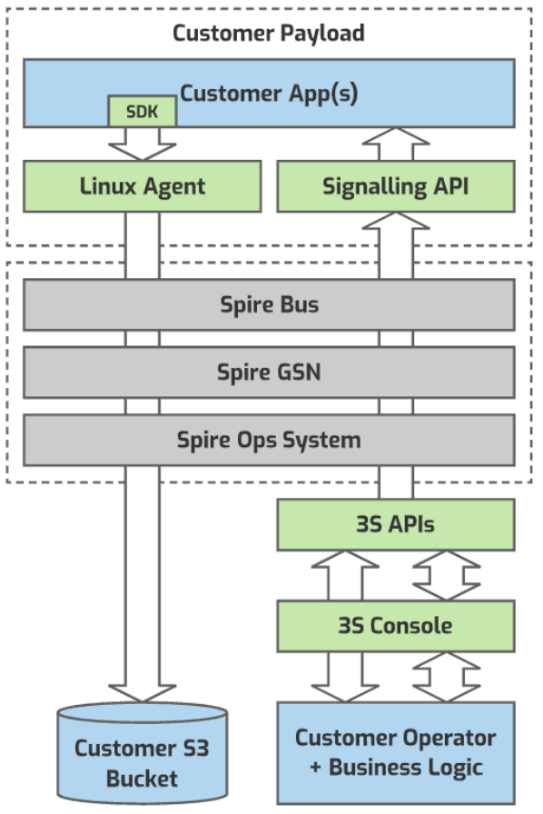
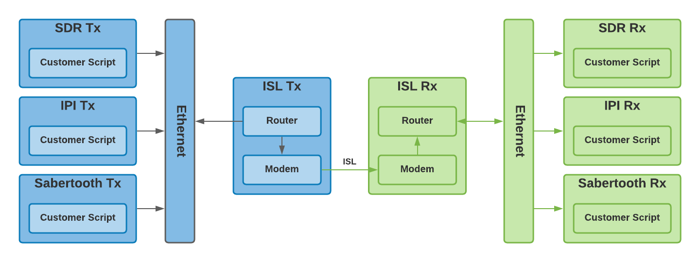

# Fundamentals

In simple terms, applications are deployed to the satellite, a time window is scheduled to run the applications, and the output is downloaded to AWS S3. Applications have access to satellite hardware and telemetry.

Everything happens as time windows on a schedule. The schedule holds all upcoming contact windows with the ground (and other satellites), and all reservation windows made by users. Users reserve specific hardware over a time window on a satellite. The schedule is synchronized with the satellite at each contact.

The satellite bus is managed and monitored by the Spire Operations Team. Users are not expected to manage or monitor the health of the various systems (batteries, solar, ADCS, station-keeping, faults etc.) as this is provided by Spire.

## Lifecycle

1. **Develop** code to run on the satellite 
1. **Deploy** applications and data to the satellite
1. **Schedule** application to run at a specific time window
1. **Wait** for window to complete & results downloaded
1. **Analyze** received data

## Execution Environment
The satellite hosts multiple Linux computers ("payloads") with each managing specific hardware (e.g. cameras, transceivers or GPUs). Spire provides a persistent isolated execution environment for the user to upload files to and run applications. An output provides a way to downlink files. A local agent provides a REST API to interact with the satellite bus (e.g. for telemetry or attitude control), as well as an SDK. It is documented [there](./ExecutionEnvironment.md).

## Satellite Bus
The satellite bus is a broad name given to the many systems on the satellite that support a users activities.  Spire maintains the satellite bus, which includes powering systems on and off, charging batteries, station-keeping, communicating with the ground (and other satellites), running the schedule, and executing user applications on the payloads. 

## Windows
A window is a reserved period of time on a specific satellite for an activity. Windows are placed in the schedule. Different window types reserve different hardware and require exclusive access to different things, e.g. attitude control. User reservations are represented as types of windows too.

### Contact Windows
A contact is a type of window created by Spire, and is a one or two-way radio transmission between a satellite and a ground-station, or between two satellites (inter-satellite links). The purpose of a contacts is broad, but includes time for maintenance, schedule synchronization and the transfer of data, logs and telemetry. Spire schedules contacts for its exclusive use - user code is not made aware of these contacts. Users may schedule their own contacts between satellites (ISL), but not between a satellite and ground station.

### Payload Windows
Each payload type (e.g. `SDR`, `SABERTOOTH` or `IPI`) has a [corresponding window](https://developers.spire.com/tasking-api-docs/#supported-windows) to execute applications in. Users schedule payload windows via the [Tasking API](https://developers.spire.com/tasking-api-docs/).

### Lease Windows
A lease is the reservation of a system over the time window. [`LEASE_ISL`](https://developers.spire.com/tasking-api-docs/#lease_isl) creates an inter-satellite-link between 2 satellites for the excusive use of the user's payloads. [`LEASE_ADCS`](https://developers.spire.com/tasking-api-docs/#lease_adcs) passes attitude control to user code running on the payloads.

## Satellite Schedule
The list of windows for each satellite is held in a schedule. The schedule contains all windows, both for contacts created by Spire and for user activities. The schedule is synchronized with the satellite at each contact. The schedule can be queried with the [`GET /windows`](https://developers.spire.com/tasking-api-docs/index.html#get-windows) API endpoint.

## Scheduling Time on a Payload
A window is inserted into the schedule with the [Tasking API](https://developers.spire.com/tasking-api-docs/index.html#post-window). The window type controls what payload is reserved. A window accepts attitude control information to enable directional control of antennas, apertures, cameras etc. 

## Uploading Files
The Tasking API provides an [`upload`](https://developers.spire.com/tasking-api-docs/index.html#post-upload) endpoint for up-linking files to a specific satellite payload. Files are cached on the ground and queued for upload at subsequent contacts, managed by Spire. Uplink bandwidth is limited. For larger files and installations Spire recommends the files be [flight-flashed](#flight-flash) to the payload prior to launch.

### Flight Flash
Flight-flash is the process of creating and flashing disk images onto the payloads file systems prior to launch.  This is often a good time for large user applications to be installed, e.g. machine learning models or frameworks like Python or TensorFlow. 

## Downloading Files
Any files found in the [`/outbox`](./ExecutionEnvironment.md) directory on a payload at the end of a window will be transferred off the payload by the satellite bus and queued for download to AWS S3. 

## Sharing Files
Payload window definitions provide the ability to have the satellite bus copy files from another payload before start. Alternatively IP networking is available between payloads when windows [overlap](https://developers.spire.com/tasking-api-docs/#overlapping-windows).  More on that in the next 3 sections...

## Window Copy Function
A window definition may contain a section to copy a file from a different payload on the satellite to this payload's `/inbox`. This supports a simplified workflow where each payload produces data for a subsequent payload on the same satellite to consume. An example would be to capture an image on the `IPI` and analyze the image on the `SABERTOOTH`. The satellite bus performs the copy operation between the two payloads.

## Inter-payload Networking
When windows on a satellite [overlap](https://developers.spire.com/tasking-api-docs/#overlapping-windows), ethernet is provided for IP networking, Ping and UDP & TCP ports 10,000+ are enabled. This allows application code to communicate, e.g. listen on a port for requests from a different payload.

## Inter-satellite Networking
Inter-satellite-links (ISL) lease windows can be scheduled for user use. They are requested with the [Tasking API](https://developers.spire.com/tasking-api-docs/) and create a Tx window on one satellite and Rx window on the other, as the link is simplex/one-way. ISL leases require a satellite pair in synchronous orbit.  An ISL lease window opens up a route to payloads on the remote/Rx satellite. To make use of the ISL network, a window would normally be created on both satellites for the same time so that the user can send data from their applications on one satellite to their applications on the other. Destination ports of 10,000+ are routed across the link. The simplex link means that TCP can not be "acknowledged" - UDP is supported.

## Spire Linux Agent
Each Linux payload runs a local agent to provide a RESTful interface to interact with the satellite bus. The services provided by the daemon are numerous, and include file up-link/down-link, telemetry, and attitude control. Additional information can be found [here](https://developers.spire.com/spire-linux-agent-docs/).

## Power
The satellite bus manages power consumption and collection of solar energy. In the unlikely event that there is not enough power to maintain the health of the satellite bus, a payload window may be aborted or not attempted at all. 

## Antennas & Apertures (Cameras)
Various antennas are made available on the Software Defined Radio (SDR) payload.  Some antennas allow for Tx/Rx while others are Rx only. Spire provides utilities for RF capture and receive.

The Imaging Payload Interface (IPI) payload provides user with access to one or more cameras. Spire provides an SDK and utilities for managing and acquiring images.

## Attitude Control
The orientation (attitude) of the satellite is controlled by an Attitude Determination and Control System (ADCS). Attitude control supports a range of modes including [nadir and target tracking](https://developers.spire.com/tasking-api-docs/#adcs_config). Additional information can be found [here](./AttitudeControl.md).

### Ground Based
When a window is scheduled, attitude can be provided. The satellites attitude is set before the start of the window.

### In-orbit - Realtime
Additionally, a window can be scheduled to allow in-orbit control of attitude from one or more payloads. This allows payloads to respond to events in real-time by pointing directional antennas and/or apertures at areas of interest. Attitude control is provided via REST API to the local agent. 

## Telemetry
Various metrics are captured on the satellite bus and made available on the ground to users. This telemetry includes power levels and attitude data. 

## Ground Stations
Spire maintains ground-stations around the globe. The location & capabilities of each ground-station affect when a user can expect their data to be uplinked or downlinked. Ground stations are fitted with some combination of UHF, S-BAND and X-BAND transceivers.

## Next Steps

 - [Getting Started Guide](./GettingStarted.md)
 - [Execution Environment](./ExecutionEnvironment.md)
