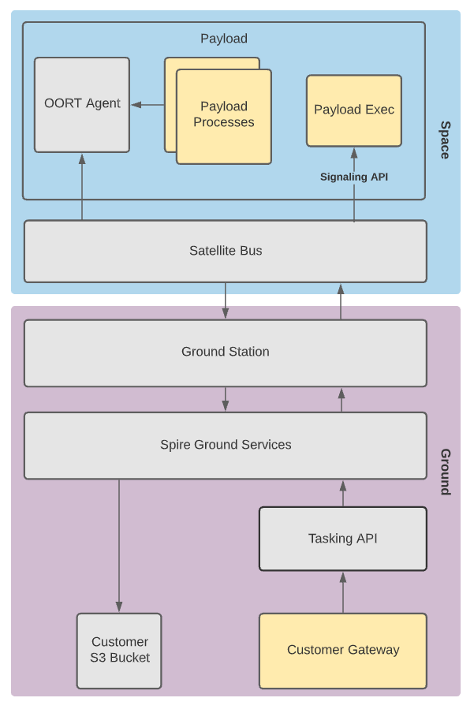

# Payload in Space User Guide

Spire’s Payload in Space offering provides customer’s access to software designed to allow customers to task, manage operations and upload software to their custom payloads in orbit.

The processes highlighted in yellow represent code required by the customer’s development team.

## Software Components

Spire provides three interface points for payload tasking and operations.

### Tasking API

A RESTful, ground API providing customers the ability to task their payload and upload files and software updates to their payload.  The Tasking API serves as the main ground based API for payload operations.

### OORT API

An API that allows users to downlink data from their payload to their ground based data storage in S3.  This API was design to abstract the complications of managing a disruption tolerant network from the end user and provide a simple, always available, way to access the data pipeline.

To interface with the OORT API, Payload developers must install an Agent daemon that runs on their payload and exposes an HTTP API.

The agent binaries (for supported architectures) and source code can be found in the [nsat/oort-agent](https://github.com/nsat/oort-agent) repository on Github.

To interface with the local OORT Agent, Spire provides [C](https://github.com/nsat/oort-sdk-c) and [Python](https://github.com/nsat/oort-sdk-python) SDKs.  For other languages, customer’s can make HTTP requests directly to the agent.

Additional documentation for the OORT API can be found [here](https://developers.spire.com/oort-docs/index.html)

### Signaling API

The Signaling API gives customers the ability to receive and act on events generated by the satellite bus, such as the start of a payload window.  The satellite bus will execute a payload developer’s program, payload_exec, with configuration for a given event.

Additional documentation for the OORT API can be found [here](https://developers.spire.com/payload-signaling-api-docs/index.html)

## Workflow

### Prior to Launch

Prior to launch, the customer is responsible for providing the customer is required to provide to Spire:

The URI for an AWS S3 bucket to deliver customer data and telemetry.  Spire must have write permissions to this bucket.
A Flight Model payload that has the OORT Agent binary pre-installed as well as a payload_exec executable to be used by the Signaling API.

Spire will provide the customer with

A username and Bearer token to access the Tasking API

### Payload Operations

After the satellite has launched and passed Checkout & Commissioning, the customer can now begin to upload additional software if necessary and start tasking their payload.

**Ground Operations**

To task a payload, the `POST /window` endpoint in the Tasking API is used.  To upload new software or arbitrary files to the payload, the ‘POST /upload` endpoint is used.

**Satellite Window Execution**

Prior to the start of the window, the satellite bus is responsible for powering on the payload and transferring any files uploaded through the Tasking API to the payload.  The satellite bus will also send a `configure` signal by calling payload_exec located on the payload.

At the start of a window, the satellite bus will send a window start signal by calling payload_exec located on the payload.  The payload_exec executable will use the window_id argument passed in from the satellite bus to locate the configuration for the current window.  The window configuration file includes configuration passed in from the satellite bus as well as any user configuration passed to the Tasking API when creating the window.

The payload_exec script is responsible for orchestrating additional payload operations for the window.

At any time during window execution software on the payload can use the OORT API to downlink files to the ground. 

**After Window Execution**

After the window is executed any data sent to the OORT API is queued for download.  After the spacecraft has received
enough contact time to download each data file, the file will be persisted to the customer's S3 bucket.

## Examples

[Download a File from Space](./examples/payload_in_space/download_file/README.md) - A trivial example showing the code necessary to create and download a file from a payload.
