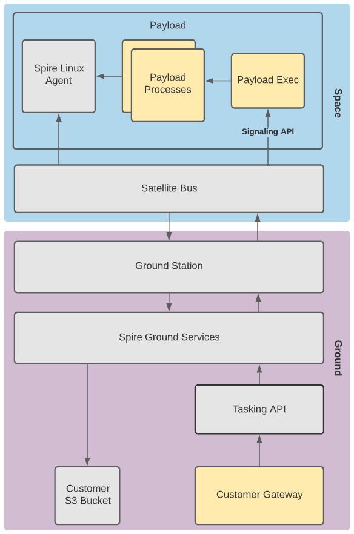

# User Guide for Payloads In Space

Payload in Space is the term used for users that own the payload being hosted by the Spire satellite bus. Users may provide Spire any hardware they wish. Where the customer chooses to run a Linux OS, install the [Spire Linux Agent], and allow Spire `ssh` & TCP port `2005` access to the payload, all of the [Software In Space](./Fundamentals.md) services are provided.

The diagram below shows the architecture for customers hosting their own payloads on a Spire satellite bus.

**Figure 1:** Processes highlighted in yellow represent code required by the user’s development team.  All of the other processes are handled by Spire software.

## Software Components

Spire provides three interface points for payload tasking and operations:

### Tasking API

The Tasking API is the direct interface for scheduling (time) windows in the Spire constellation. A window is an operation with a type, a start time, and an end time.  The API can be used directly for manual scheduling of individual windows or, more commonly, as a service for automated scheduling systems. The Tasking API provides a set of endpoints used to task, configure, and manage payload operations via a RESTful API web-service. 

Users will interact with this API to create Payload Windows which define the start and end times of an operation for a given window type (payload operation type), as well as set the configuration or parameters of the desired operation.

Additionally, the Tasking API can be used to upload software or any other arbitrary file to the user's payload.

Additional documentation for the Tasking API can be found [here](https://developers.spire.com/tasking-api-docs/).

#### Spire Linux Agent

The Spire Linux Agent (formally OORT Agent) is a daemon that Payload in Space customers install and run on their payload.  The daemon provides access to the Data Pipeline APIs.

The agent binaries (for supported architectures) and source code can be found in the 
[`nsat/oort-agent`](https://github.com/nsat/oort-agent) repository on Github.

To interface with the Spire Linux Agent, Spire provides a [C SDK](https://github.com/nsat/oort-sdk-c) and a [Python SDK](https://github.com/nsat/oort-sdk-python).

<aside class="notice">Access to the github source code and binaries requires approval by the Spire Space Services sales team.</aside>

For other programming languages, users’s can make HTTP REST requests directly to the agent.

The agent currently only supports Linux payloads with an `ssh` daemon running, and TCP ports `22` and `2005` open on the firewall.

Additional documentation for the Spire Linux Agent can be found [here](https://developers.spire.com/spire-linux-agent-docs/)

### Data Pipeline API

The Data Pipeline API is available in-orbit, and allows users to download data from their payload to their ground based data storage in S3. The API abstracts away the complications of managing a disruption tolerant network from the end user and provides a simple and always available way to send data to the ground.

The Data Pipeline API is made available by the [Spire Linux Agent](https://developers.spire.com/spire-linux-agent-docs/) and associated SDKs.

More information on the Data Pipeline API and full API specs can be found [here](https://developers.spire.com/data-pipeline-docs/)

### Signaling API

The Signaling API gives the users' payloads the ability to receive and act on events generated by the satellite bus, 
such as the start of a payload window. The satellite bus executes the program `/usr/bin/payload_exec`. This is authored and provided by the user. Arguments are provided to the executable.

<aside class="notice">The Signaling API currently only supports Linux payloads with an ssh daemon running and TCP port 22 open on the firewall.</aside>

Additional documentation for the Signaling API can be found [here](https://developers.spire.com/payload-signaling-api-docs/)

## Workflow

### Prior to Launch

Prior to launch, the user is responsible for providing Spire with:

* The URI for an AWS S3 bucket to deliver user data and telemetry.  Spire must have write permissions to this bucket.
* Production payload hardware with flight flashed software including the Spire Linux Agent binary pre-installed as well as a `payload_exec` executable to be used by the Signaling API
* TCP ports `22` and `2005` open on the firewall
* Optionally for [ISL](./ExecutionEnvironment.md#inter-satellite-links_isl) access, the following route should be configured:
   * SUBNET: 172.16.0.0/24
   * GATEWAY 10.1.1.10

Spire provides the user with:

* A Bearer token to access the Tasking API

### Payload Operations

After the satellite has launched and passed Checkout & Commissioning, the user can then begin to upload additional software if necessary and start tasking their payload.

#### Ground Operations

To task a payload, the [`POST /window`](https://developers.spire.com/tasking-api-docs/#post-window) endpoint in the Tasking API is used.  To upload new software or arbitrary files to the payload, the [`POST /upload`](https://developers.spire.com/tasking-api-docs/#post-upload) endpoint is used.

#### Satellite Window Execution

Prior to the start of the window, the satellite bus is responsible for powering on the payload and transferring any files uploaded through the Tasking API to the payload.  The satellite bus will also send a `configure` signal by calling `/usr/bin/payload_exec` located on the payload.

At the start of a window, the satellite bus will send a window start signal by calling `payload_exec` located on the payload.  The `payload_exec` executable will use the window_id argument [passed in from the satellite bus](https://developers.spire.com/payload-signaling-api-docs/#configure) to locate the configuration for the current window.  The window configuration file includes configuration passed in from the satellite bus as well as any user configuration passed to the Tasking API when creating the window.

The `payload_exec` script is responsible for orchestrating additional payload operations for the window.

At any time during window execution software on the payload can use the Data Pipeline API to downlink files to the ground. 

#### After Window Execution

After the window is executed any data sent to the Data Pipeline API is queued for download.  After the spacecraft has received
enough contact time to download each data file, the file will be persisted to the user's S3 bucket.

## Examples

[Download a File from Space](./examples/payload_in_space/download_file/README.md) - A trivial example showing 
the code necessary to create and download a file from a payload.

