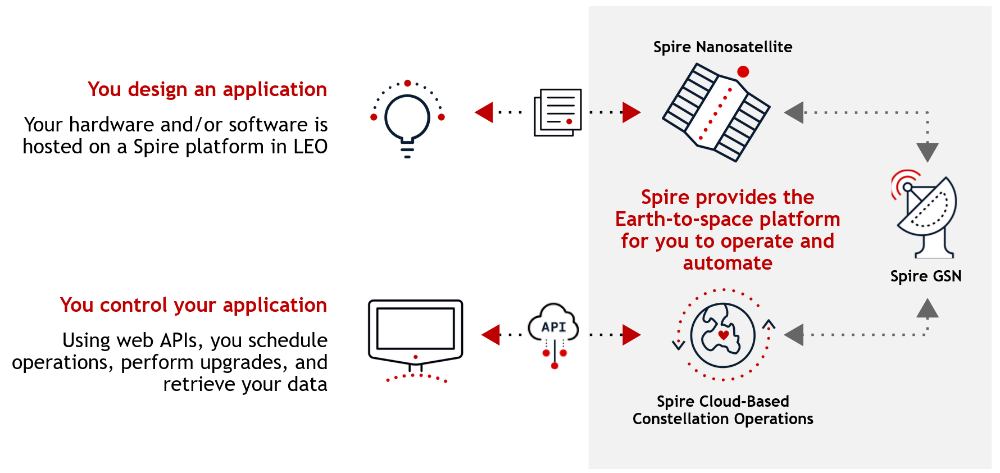
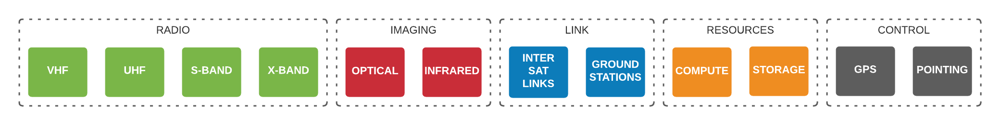

# Software In Space

<table>
    <tr>
        <td>
            <h3 id="run-code-in-space">Run Code In Space</h3>
            
 Develop and run code and scripts in a Linux environment on the Satellite.

        </td>
        <td>
            <h3 id="perform-experiments--amp--gather-data">Perform Experiments &amp; Gather Data</h3>
            
 Persistent execution environment for apps and data. 

        </td>
    </tr>
    <tr>
        <td>
            <h3 id="control-satellite-systems">Control Satellite Systems</h3>
            
 Programmatic and command line access to transceivers and satellite orientation. 

        </td>
        <td>
            <h3 id="contact-ground--amp--space-assets">Contact Ground &amp; Space Assets</h3>
            
 Let Spire handle the transfer of data, or go direct with inter-satellite and satellite bus networking. 

        </td>
    </tr>
</table>

Develop and deploy code to space. Schedule time on satellite hardware. Track targets with a range of antennas and apertures. Analyze data with GPU hardware. Send and receive using Spire ground-stations or self-managed ground assets on a variety of frequencies. Leverage inter-satellite-links for complex real-time operations. Orient satellites to an area of interest.

# Payload In Space

Payload in Space is the term used for users that own the payload(s) hosted by Spire on the satellite bus. Users may provide Spire any hardware they wish. Where the customer chooses to run Linux & configure the [necessary prerequisites](./PayloadInSpace.md), all of the [Software In Space](./Fundamentals.md) services are provided.

## Next Steps

Learn the fundamentals of how it works, or jump straight into the documentation or tutorials.

### How It Works

[Learn about the fundamentals of Spire Space Services](./Fundamentals.md)

### Getting Started

[Follow the step-by-step guide to get started](./GettingStarted.md)

### Documentation

 - [Payload In Space](./PayloadInSpace.md)
 - [Tasking API](https://developers.spire.com/tasking-api-docs/)
 - [Spire Linux Agent (in-orbit)](https://developers.spire.com/spire-linux-agent-docs/)
 - [Data Pipeline API (in-orbit)](https://developers.spire.com/data-pipeline-docs/)

### FAQ

[Check out the FAQ for an ever-growing list of helpful answers to common questions](./FAQ.md)
