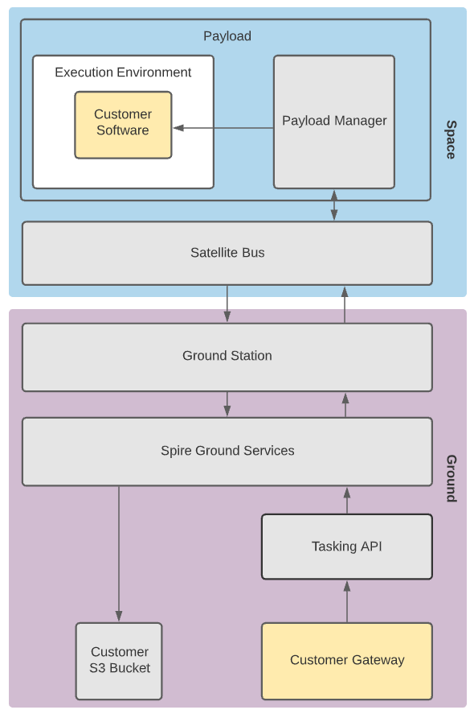

# Payload in Space User Guide

Spire provides a suite of software services that allows Software in Space users to task, manage and download files from their
execution environment on the spacecraft.

The purpose of this guide is to show how users can leverage these services for payload operations and workflows.

## Tasking API

The Spire Tasking API is the direct interface for scheduling windows in the Spire constellation. 
It can be used directly for manual scheduling of individual windows or, more commonly, as a service for 
automated scheduling systems. The Tasking API provides a set of endpoints used to task, configure, 
and manage payload operations via a RESTful API web-service. 

Users will interact with this API to create Payload Windows which define the start and end times of an 
operation for a given window type (payload operation type), as well as set the configuration or parameters 
of the desired operation.

Additionally, the Tasking API can be used to upload software or any other arbitrary file to the user's execution 
environment

Additional documentation for the Tasking API can be found [here](https://developers.spire.com/tasking-api-docs/index.html).

## Execution Environment

User's software runs in a sandboxed execution environment on a Spire payload.  User software is uploaded to this sandbox environment
through the Tasking API.  User software has access to it's own filesystem and various software libraries, the specifics of which depend on 
which payload the customer is scheduling operations on.

The execution environment includes two top level directories used to manage incoming and outgoing data:

* `/inbox` - Spire generated files during a payload window will be placed into this folder.  For example, IQ files captures during a PAYLOAD_SDR window will appear in this folder.
* `/outbox` - Any files placed in this folder by user software will be queued for downlink.

## Workflow

### Prior to Launch

Prior to launch, the user is responsible for providing Spire with:

* The URI for an AWS S3 bucket to deliver user data and telemetry.  Spire must have write permissions to this bucket.

Spire will provide the user with:

* A username and Bearer token to access the Tasking API.

### Payload Operations

After receiving access to run software on a Spire Payload, the user can begin using the Tasking API to interface with the satellite.

**Ground Operations**

When first starting operations on a new payload, the user must upload their software to the payload using the `POST /upload` endpoint exposed by the Tasking API.  It is
recommended that the user wait for the software to successfully upload to the payload before tasking operations.  The status of an upload can be checked by using the
`GET /uploads` endpoint exposed by the Tasking API.  Once uploaded, the software can be used in any future payload window execution.

After the user has successfully uploaded their software to the payload, a payload window can be created using the `POST /window` endpoint exposed by the Tasking API.  This will
schedule time on the spacecraft on to run the payload and execute any user code specified in the window parameters.

**Satellite Window Execution**

At the start of a window, the payload will execute any Spire commands requested through the Tasking API.  For example, if an IQ capture was requested for a PAYLOAD_SDR window, 
the Payload Manager would execute and IQ capture and place the resulting file in the user's inbox.

After all Spire commands are run, any commands to execute customer software are run by the Payload Manager.

Following the end of the window, any files placed in the user's outbox by customer software will be queued for download to the ground.

**After Window Execution**

After the spacecraft has received enough contact time to download a data file queued for download, the file will be persisted to the user's S3 bucket.

## Examples
