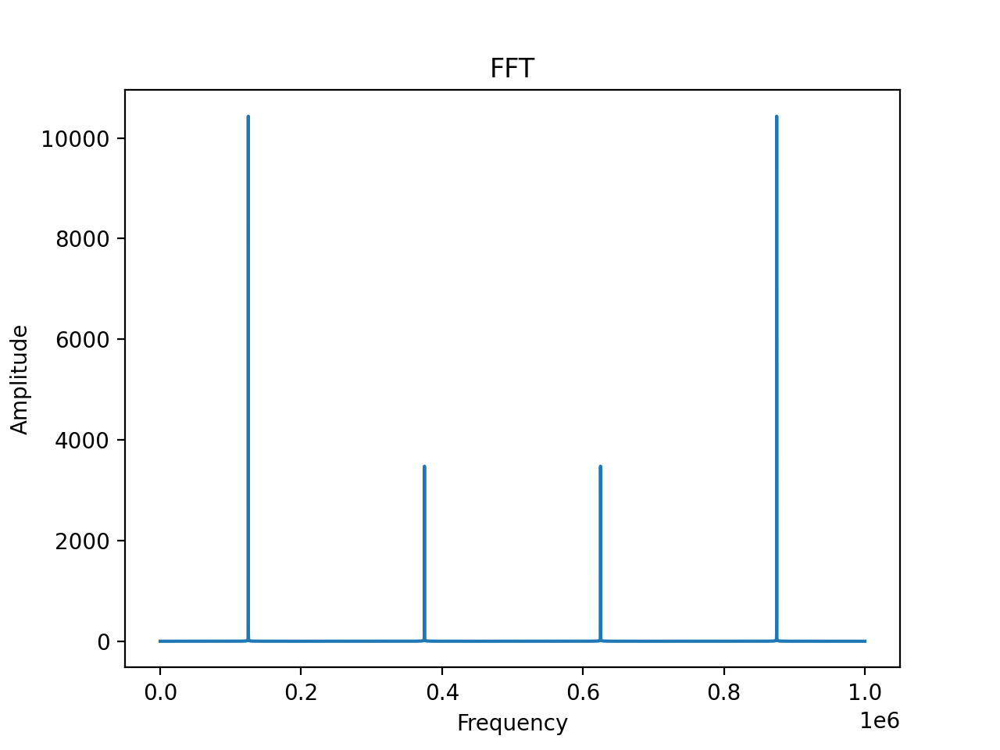
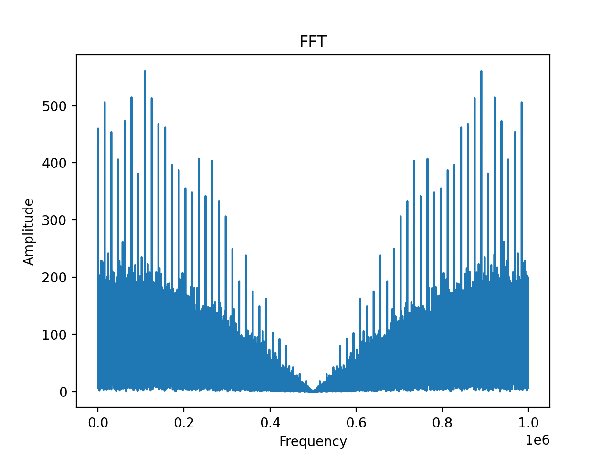
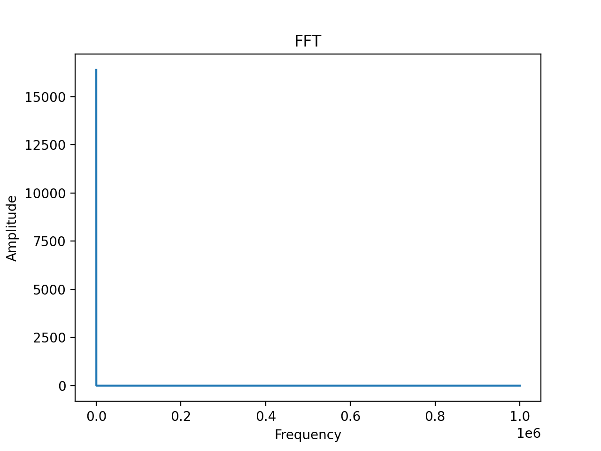

# Tools & Utilities

The following tools and utilities are developed and supported by Spire, and provided on the applicable payload(s) for users to run directly or indirectly within a payload windows [`user_command`⤴](https://developers.spire.com/tasking-api-docs/#user_command) parameter.


## RF Collect

|Payloads|`SDR`|
|-|-|

```shell
rfcollect
  -w <file>        IQ file to receive
  -S <start>       Start UTC time of the capture in s, 0 will directly starts (default=0s)
  -d <duration>    Duration of the capture in s, (default=10s)
  -f <freq>        Set frequency RX Hz (default=2022500000Hz)
  -g <gain>        Set RX gain dB (range -3dB to 70dB, default=70dB)
  -s <fs>          Set RX sample rate Hz (default=1000000Hz)
  -b <bdw>         Set RX bandwidth Hz (default=1000000Hz)
  -m <band>        SBAND|UHF (default=SBAND)
  -o               Print the logging on stdout instead in file (/var/log/rfcollect.log).
  -l <lvl>         Set log level DEBUG=0, INFO=1, WARN=2, ERR=3, NONE=4 (default=1).
  -h               Help

  NOTE: The capture IQ file size is limited to 1024 MB
```


Chroot friendly command to collect raw in-phase quadrature (IQ) files (`int16` format). When executing `rfcollect`, the IQ is captured from the indicated UTC start (`-S`) time for the required duration (`-d`) period. Then it is written in the indicated output file (`-w`). The output file size is limited to 1GB.

The command returns when the capture is finished and the IQ samples are written in the output file, or when an error occurs.

The IQ can be recorded from UHF or SBAND (`-m`).

More information can be found about IQ [here](https://en.wikipedia.org/wiki/In-phase_and_quadrature_components).


## RF Transmit

|Payloads|`SDR`|
|-|-|

```shell
rftransmit 
  -w <file>        IQ file to transmit
  -r <period>      Period in second at which the file is repeated (default=0s).
                   If the file to play is longer than the period, the samples are cut
                   to the period. If the period is 0, the file is play continuously
                   without pause or cut.
  -c <play>        Number of time the IQ file is played (-1 means infinite) (default=1)
  -f <freq>        Set frequency TX Hz (default=2022500000Hz)
  -g <gain>        Set TX gain dB (range -80dB to 0dB, default=-8dB)
  -s <fs>          Set TX sample rate Hz (default=1000000Hz)
  -b <bdw>         Set TX bandwidth Hz (default=1000000Hz)
  -m <band>        SBAND|UHF (default=SBAND)
  -o               Print the logging on stdout instead in file (/var/log/rftransmit.log).
  -l <lvl>         Set log level DEBUG=0, INFO=1, WARN=2, ERR=3, NONE=4 (default=1).
  -h               Help
```

Chroot friendly application to transmit raw in-phase quadrature (IQ) files (`int16` format). When executing `rftransmit`, it is possible to indicate the number of times (`-c`) the file is transmitted (e.g `-c 10` means transmit IQ file 10 time), and the period (`-r`) at which it is repeated.

If the period at which the file needs to be repeated is smaller than the time to play the IQ file, the IQ file is cut to the repetition period. If no interval between repetition is indicated, the file is repeated as soon as it has been played.

```
|                         |                         |                         |
| |----------|            | |----------|            | |----------|            |
|-|    IQ    |------------|-|    IQ    |------------|-|    IQ    |------------|
| |----------|            | |----------|            | |----------|            |
|                         |                         |                         |

x-------------------------X
              |
    Period at which the
      file is repeated
```

The command returns after playing the IQ file the indicated number of times or when an error occurs.

The IQ can be transmitted to UHF or SBAND (`-m`).

More information can be found about IQ [here](https://en.wikipedia.org/wiki/In-phase_and_quadrature_components).


## IQ generator

|Payloads|`IPI`|
|-|-|

```shell
iqgenerator 
  -f <iqfile>               IQ filename
  -S <samples-per-symbol>   Samples Per Symbol [default=2]
  -b <bits-per-symbol>      BPSK=1, QPSK=2, PSK8=3 [default=1]
  -d                        Enable differential encoding. (enabled by default with square|pn9)
  -s <signal>               square|random|ones|zeros|pn9|coded|tone [default=square]
  -o                        Print the logging on stdout instead in a file /var/log/iqgenerator.log.
  -l <lvl>                  Set log level DEBUG=0, INFO=1, WARN=2, ERR=3, NONE=4 [default=1].
  -h                        help
```

This utility generates [IQ](./FAQ/#iq-file) files based on the desired signal based on coding (BPSK, QPSK, PSK8) and sample per symbol. The types of signals available are:

- `tone`, all bytes are `0x00`
- `square`, all bytes are `0xAA`
- `random`, all word are randomly generated using `stdlib` `rand()`
- `ones`, all bytes are `0x01`
- `pn9`

| Signal |  |
|--|--|
| <h3>Tone</h3>  | <h3>Square</h3>  |
| <h3>Random</h3>  | <h3>pn9</h3>  |
| <h3>ones</h3>  |  |


## Next Steps

 - [Getting Started Guide](./GettingStarted.md)
