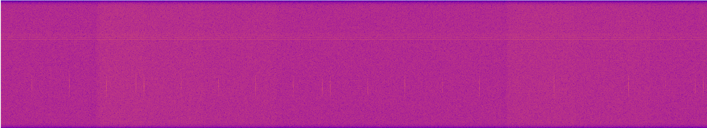

# RF Collect Tutorial

|Complexity:|Easy|
|-|-|
|Payloads:|`SDR`|
|Windows:|`PAYLOAD_SDR`|

This tutorial will demonstrate receiving signals from the S-BAND radio on the `SDR` using the [`rfcollect`](../../Utilities.md#rf-collect) utility, and download the produced [`IQ`](https://en.wikipedia.org/wiki/In-phase_and_quadrature_components) and log files. The frequency can be changed to capture specific signals. 


## Prerequisites

1. [Tasking API Authentication Token](https://developers.spire.com/tasking-api-docs/#authentication)
1. The `FM` number of a satellite with an SDR payload
1. An AWS S3 bucket set up with Spire
1. `curl` or similar


## Develop

Create a script that will run on the `SDR` Linux payload called `rf_collect.sh`. Append the date and the system name to help diagnose any issues. The default options of `rfcollect` make a 10 second 1MHz wide sample of the 2.0225 GHz S-BAND spectrum with a sample rate of 1MHz. This produces a 4MB IQ file (16bit in-phase + 16bit quadrature (4 bytes) @ 1MHz).

```sh
#!/usr/bin/env sh

date > /outbox/rf_collect.log
uname -a >> /outbox/rf_collect.log
(rfcollect -w /outbox/rf_collect.iq -o -l 0 2>&1 || echo "rfcollect error: $?") >> /outbox/rf_collect.log

```

Mark it executable and test it. An error message is expected because `rfcollect` is likely not available.

```bash
chmod 755 rf_collect.sh
mkdir /outbox
./rf_collect.sh
cat /outbox/rf_collect.log
```

Output:

```bash
Tue Dec 14 05:20:03 UTC 2021
Linux 66891b47365c 5.10.16.3-microsoft-standard-WSL2 #1 SMP Fri Apr 2 22:23:49 UTC 2021 x86_64 Linux
./rf_collect.sh: line 4: rfcollect: not found
rfcollect error: 127
```


## Deploy

Upload the script via the [Tasking API](https://developers.spire.com/tasking-api-docs/#post-upload) to the `SDR` on the satellite. Please change `<FM>` to the satellite `id`, and `<token>` to the token provided by Spire.

```bash
HOST="https://api.orb.spire.com"
AUTH_HEADER="Authorization: Bearer YOUR_AUTH_TOKEN"

SATELLITE_ID="satellite_id=FM1"
PAYLOAD="payload=SDR"
DESTINATION_PATH="destination_path=/persist/bin/rf_collect.sh"
EXECUTABLE="executable=true"
QUERY_PARAMS="${SATELLITE_ID}&${PAYLOAD}&${DESTINATION_PATH}&${EXECUTABLE}"

curl -X POST ${HOST}/tasking/upload?${QUERY_PARAMS} \
-H "${AUTH_HEADER}"  \
-F "file=@rf_collect.sh"
```

Response:

```json
{"data": {"id": "d25c7a43-b70d-4f57-81d5-ff5177b26158"}}
```

At this point the file has been queued for upload at the next possible contact. 


## Wait

We can poll for the status of the upload with the following command, and wait until it changes from `PENDING` to `UPLOADING` then finally `UPLOADED`.

```bash
curl -X GET -H "${AUTH_HEADER}" ${HOST}/tasking/uploads
```

Response:

```json
{
  "data": [
    {
      "satellite_id": "FM1",
      "payload": "SDR",
      "destination_path": "/persist/bin/rf_collect.sh",
      "executable": true,
      "status": "PENDING",
      "id": "d25c7a43-b70d-4f57-81d5-ff5177b26158",
    }
  ]
}
```


## Schedule Execution

Add a [`PAYLOAD_SDR`](https://developers.spire.com/tasking-api-docs/#payload_sdr) window to the schedule for in 6 hours. 6 hours was chosen as it's the earliest time that the window is likely run.

```bash
START=$(( `date -u +'%s'` + 21600 ))

curl -X POST ${HOST}/tasking/window \
-H "${AUTH_HEADER}" \
-H "Content-Type: application/json" \
-d @- << EOF
{
    "type": "PAYLOAD_SDR",
    "satellite_id": "FM1",
    "start": ${START},
    "duration": 60,
    "parameters": {
        "user_command": {
            "executable": "/persist/bin/rf_collect.sh"
        }
    }
}
EOF
```

Response:

```json
{"data": {"id": "3020553"}}
```


## Wait

Schedule synchronization can be polled by querying for upcoming windows. `state` will change from `PENDING_SYNC` to `SYNCED`.

```bash
SATELLITE_ID="satellite_id=FM1"
QUERY_PARAMS="${SATELLITE_ID}"

curl -X GET -H "${AUTH_HEADER}" "${HOST}/tasking/windows?${QUERY_PARAMS}"
```

Response:

```json
{
  "data": [{
    "id": "3020553",
    "type": "PAYLOAD_SDR",
    "satellite_id": "FM1",
    "state": "PENDING_SYNC",
    "start": 1599503800,
    "duration": 60,
    "parameters": {
        "user_command": {
            "executable": "/persist/bin/rf_collect.sh"
        }
    }
  }]
}
```

After `rf_collect.sh` has run on the `SDR` the output files will be picked up by the satellite bus and queued for downlink to AWS S3.


## Analyze

The files can be found in S3 with the timestamp appended to guarantee uniqueness. The `awscli` can be used with the `--recursive` option to see the files:

```bash
aws s3 ls --recursive s3://customer-s3-bucket/a/directory/FM1/downlink/
```

Response:

```bash
2021-09-06 04:32:29          0 2021/
2021-09-06 04:32:29          0 2021/09/
2021-09-06 04:32:29          0 2021/09/06/
2021-09-06 04:32:29       2568 2021/09/06/20210906T043229Z_rf_collect.log
2021-09-06 04:32:29    4000000 2021/09/06/20210906T043229Z_rf_collect.iq
```

The IQ file can be further analyzed using digital signal analysis (DSP). For example the file can be loaded in [Universal Radio Hacker](https://github.com/jopohl/urh) to view the spectrum:

