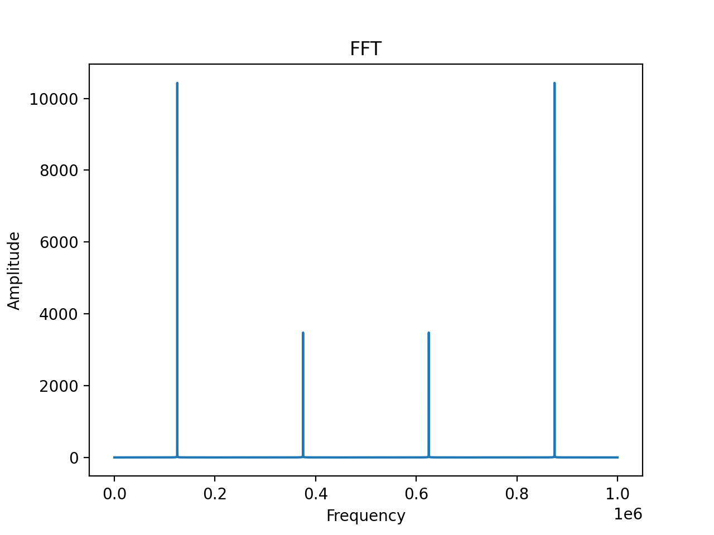
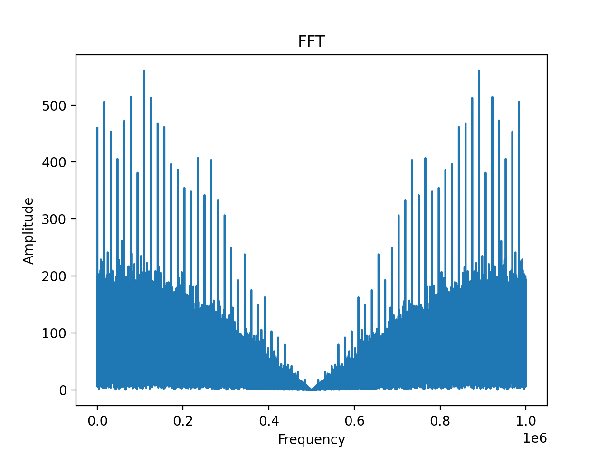
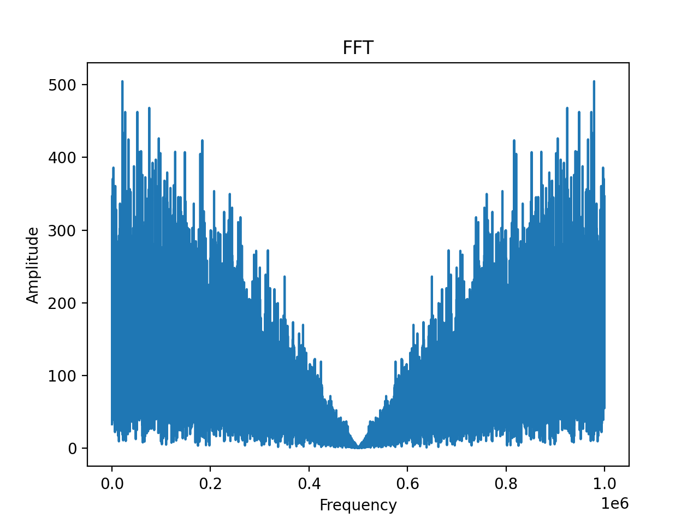
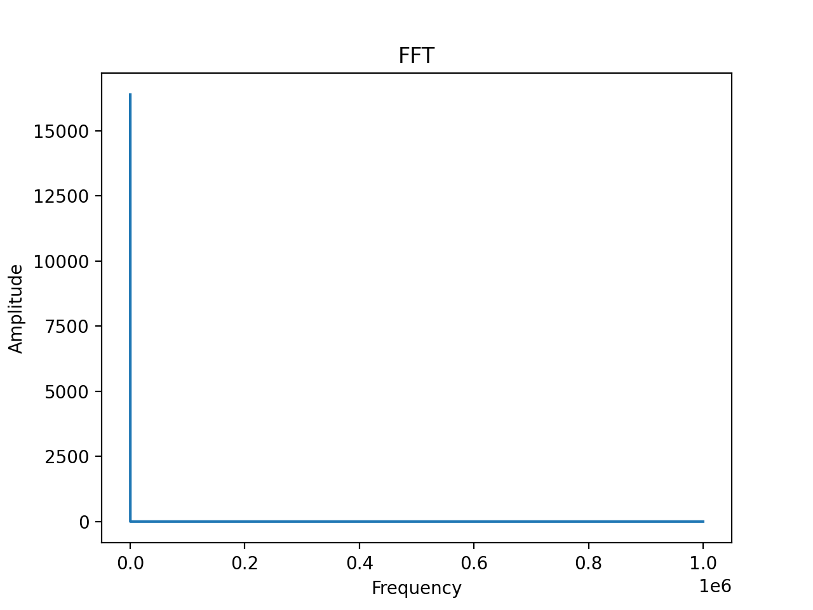

---
title: Software User Guide

search: true
---    
# Software User Guide


Spire Space Services provides a suite of APIs, libraries and services to enable customers to schedule payload operations, 
interface with the satellite bus and provide execution environments for customer code hosted in space.  The purpose of this guide is to show how 
users can leverage these services for payload operations and workflows.

For customers hosting their own payloads on a Spire satellite bus, please refer to the Payload in Space section of this guide.

For customers deploying software to existing Spire hardware, please refer to the Software in Space section of this guide.

# Payload in Space

The diagram below shows the architecture for customers hosting their own payloads on a Spire satellite bus.


The processes highlighted in yellow represent code required by the user’s development team.  All of the other processes are
handled by Spire software.

## Software Components

Spire provides three interface points for payload tasking and operations.

### Tasking API

The Tasking API is the direct interface for scheduling (time) windows in the Spire constellation. A window is an operation with a type, a start time, and an end time. 
The API can be used directly for manual scheduling of individual windows or, more commonly, as a service for 
automated scheduling systems. The Tasking API provides a set of endpoints used to task, configure, 
and manage payload operations via a RESTful API web-service. 

Users will interact with this API to create Payload Windows which define the start and end times of an 
operation for a given window type (payload operation type), as well as set the configuration or parameters 
of the desired operation.

Additionally, the Tasking API can be used to upload software or any other arbitrary file to the user's payload.

Additional documentation for the Tasking API can be found [here](https://developers.spire.com/tasking-api-docs/index.html).

### Spire Linux Agent

The Spire Linux Agent (formally OORT Agent) is a daemon that Payload in Space customers install and run on their payload.  The daemon provides access to
the Data Pipeline APIs.

The agent binaries (for supported architectures) and source code can be found in the 
[nsat/oort-agent](https://github.com/nsat/oort-agent) repository on Github.

To interface with the Spire Linux Agent, Spire provides a [C SDK](https://github.com/nsat/oort-sdk-c)
and a [Python SDK](https://github.com/nsat/oort-sdk-python).

Note: Access to the github source code and binaries requires approval by the Spire Space Services sales team.

For other programming languages, users’s can make HTTP requests directly to the agent.

The agent currently only supports linux payloads with an ssh daemon running.

Additional documentation for the Spire Linux Agent can be found [here](https://developers.spire.com/spire-linux-agent-docs/index.html)

### Data Pipeline API

The Data Pipeline API allows users to download data from their payload to their ground based data storage in S3.  
This API was designed to abstract the complications of managing a disruption tolerant network from the end user 
and provide a simple, always available, way to access the data pipeline.

The Data Pipeline API is made available by the Spire Linux Agent and associated SDKs (see Spire Linux Agent section above).

More information on the Data Pipeline API and full API specs can be found [here](https://developers.spire.com/data-pipeline-docs/index.html)


### Signaling API

The Signaling API gives user's payloads the ability to receive and act on events generated by the satellite bus, 
such as the start of a payload window. The satellite bus will execute an executable developed by the customer, `payload_exec`, 
with configuration for a given event.

The Signaling API currently only supports linux payloads with an ssh daemon running.

Additional documentation for the Signaling API can be found [here](https://developers.spire.com/payload-signaling-api-docs/index.html)

## Workflow

### Prior to Launch

Prior to launch, the user is responsible for providing Spire with:

* The URI for an AWS S3 bucket to deliver user data and telemetry.  Spire must have write permissions to this bucket.
* Production payload hardware with flight flashed software including the Spire Linux Agent binary pre-installed as well as a payload_exec 
executable to be used by the Signaling API.

Spire will provide the user with:

* A username and Bearer token to access the Tasking API.

### Payload Operations

After the satellite has launched and passed Checkout & Commissioning, the user can now begin to upload additional 
software if necessary and start tasking their payload.

**Ground Operations**

To task a payload, the `POST /tasking/window` endpoint in the Tasking API is used.  To upload new software or arbitrary 
files to the payload, the `POST /tasking/upload` endpoint is used.

**Satellite Window Execution**

Prior to the start of the window, the satellite bus is responsible for powering on the payload and transferring any 
files uploaded through the Tasking API to the payload.  The satellite bus will also send a `configure` signal by calling 
payload_exec located on the payload.

At the start of a window, the satellite bus will send a window start signal by calling payload_exec located on the payload.  
The payload_exec executable will use the window_id argument passed in from the satellite bus to locate the configuration 
for the current window.  The window configuration file includes configuration passed in from the satellite bus as well 
as any user configuration passed to the Tasking API when creating the window.

The payload_exec script is responsible for orchestrating additional payload operations for the window.

At any time during window execution software on the payload can use the Data Pipeline API to downlink files to the ground. 

**After Window Execution**

After the window is executed any data sent to the Data Pipeline API is queued for download.  After the spacecraft has received
enough contact time to download each data file, the file will be persisted to the user's S3 bucket.

## Examples

[Download a File from Space](https://github.com/nsat/space-services-user-guide/tree/main/examples/payload_in_space/download_file/README.md) - A trivial example showing 
the code necessary to create and download a file from a payload.

# Software in Space

Spire provides a suite of software services that allows Software in Space users to task, manage and download files from their
execution environment on the spacecraft.

The purpose of this guide is to show how users can leverage these services for payload operations and workflows.


## Tasking API

The Spire Tasking API is the direct interface for scheduling windows in the Spire constellation. 
It can be used directly for manual scheduling of individual windows or, more commonly, as a service for 
automated scheduling systems. The Tasking API provides a set of endpoints used to task, configure, 
and manage payload operations via a RESTful API web-service. 

Users will interact with this API to create Payload Windows which define the start and end times of an 
operation for a given window type (payload operation type), as well as set the configuration or parameters 
of the desired operation.

Additionally, the Tasking API can be used to upload software or any other arbitrary file to the user's execution 
environment.

Additional documentation for the Tasking API can be found [here](https://developers.spire.com/tasking-api-docs/index.html).

## Execution Environment

User's software runs in a sandboxed execution environment on a Spire payload.  User software is uploaded to this sandbox environment
through the Tasking API.  User software has access to it's own filesystem and various software libraries, the specifics of which depend on 
which payload the customer is scheduling operations on.  The file system is persistent between contacts, files saved to the user's filesystem
will persist until they are deleted by the user.

The execution environment includes two top level directories used to manage incoming and outgoing data:

* `/inbox` - Spire generated files during a payload window will be placed into this folder. 
For example, IQ files captures during a PAYLOAD_SDR window will appear in this folder.  File names and types placed in this folder
will vary between window types, please consult the [Tasking API documentation](https://developers.spire.com/tasking-api-docs/index.html) 
for details about a specific window.  Files placed in this folder should be handled during the window which they are generated.
* `/outbox` - Any files placed in this folder by user software will be queued for downlink.  Files placed here will be removed by the Spire Linux Agent after 
any payload window.

## Payload Specifications

Below are the list of specifications for each payload type accessible to Software in Space customers including the list of packages pre-installed on the payload.

### SDR

| Attribute    | Value                               |
| ------------ | ------------------------------------|
| SoC          | Xilinx Zynq UltraScale+ ZU4CG       |
| CPU          | 2x ARM Cortex A53 @ 1.3GHz (+ 2x ARM Cortex R5F @ 533Mhz)	|
| Memory       | 2GB                                 |
| OS           | Yocto Poky 2.5 (Sumo)               |
| Arch         | 64-bit armv8-hardfp	             |
| Kernel       | Linux 4.14.0                        |
| Package List | [List](./text/sdr_package_list.txt) |
| Utilities    | - [RF Collect](#rf-collect)<br> - [RF Transmit](#rf-transmit)<br> - [IQ Generator](#iq-generator) |


### Sabertooth

| Attribute    | Value                               |
| ------------ | ------------------------------------|
| SoC          | NVIDIA Tegra TX2i                   |
| CPU          | 4x ARM Cortex A57 @ 2GHz (+ 2x Denver 2 @ 2Ghz) |
| Memory       | 8GB                                 |
| OS           | Ubuntu 18.04.2                      |
| Arch         | 64-bit armv8-hardfp	             |
| Kernel       | Linux 4.9.140                       |
| Package List | [List](./text/sabertooth_package_list.txt) |


### Dexter

| Attribute    | Value                               |
| ------------ | ------------------------------------|
| SoC          | Xilinx Zynq 7020                    |
| CPU          | 2x ARM Cortex A9 @ 866MHz	         |
| Memory       | 1GB                                 |
| OS           | Yocto Poky 2.3 (Pyro)               |
| Arch         | 32-bit armv7-hardfp	             |
| Kernel       | Linux 4.6.0-2016_R2                 |
| Package List | [List](./text/dexter_package_list.txt) |

## Workflow

### Prior to Launch

Prior to launch, the user is responsible for providing Spire with:

* The URI for an AWS S3 bucket to deliver user data and telemetry.  Spire must have write permissions to this bucket.

Spire will provide the user with:

* A username and Bearer token to access the Tasking API.

### Payload Operations

After receiving access to run software on a Spire Payload, the user can begin using the Tasking API to interface with the satellite.

**Ground Operations**

When first starting operations on a new payload, the user must upload their software to the payload using the `POST /upload` endpoint exposed by the Tasking API.  It is
recommended that the user wait for the software to successfully upload to the payload before tasking operations.  The status of an upload can be checked by using the
`GET /tasking/uploads` endpoint exposed by the Tasking API.  Once uploaded, the software can be used in any future payload window execution.

After the user has successfully uploaded their software to the payload, a payload window can be created using the `POST /window` endpoint exposed by the Tasking API.  This will
schedule time on the spacecraft on to run the payload and execute any user code specified in the window parameters.

**Satellite Window Execution**

At the start of a window, the payload will execute any Spire commands requested through the Tasking API.  For example, if an IQ capture was requested for a PAYLOAD_SDR window, 
the Payload Manager would execute and IQ capture and place the resulting file in the user's inbox.

After all Spire commands are run, any commands to execute customer software are run by the Payload Manager.

Following the end of the window, any files placed in the user's outbox by customer software will be queued for download to the ground.

**After Window Execution**

After the spacecraft has received enough contact time to download a data file queued for download, the file will be persisted to the user's S3 bucket.

## Examples

[Capture an signal using the SDR payload and download a compressed IQ file](https://github.com/nsat/space-services-user-guide/tree/main/examples/software_in_space/compress_iq_file/README.md) -
A trivial example showing the code necessary to capture a signal using the SDR payload, compressing the resulting IQ file, and downloading the compressed file from the 
payload to S3.


## Tools & Utilities
The following tools and utilities are developed and supported by Spire, and provided on the applicable payload(s):


### RF Collect

```shell
rfcollect
  -w <file>        IQ file to receive
  -S <start>       Start UTC time of the capture in s, 0 will directly starts (default=0s)
  -d <duration>    Duration of the capture in s, (default=10s)
  -f <freq>        Set frequency RX Hz (default=2022500000Hz)
  -g <gain>        Set RX gain dB (range -3dB to 70dB, default=70dB)
  -s <fs>          Set RX sample rate Hz (default=1000000Hz)
  -b <bdw>         Set RX bandwidth Hz (default=1000000Hz)
  -m <band>        SBAND|UHF (default=SBAND)
  -o               Print the logging on stdout instead in file (/var/log/rfcollect.log).
  -l <lvl>         Set log level DEBUG=0, INFO=1, WARN=2, ERR=3, NONE=4 (default=1).
  -h               Help

  NOTE: The capture IQ file size is limited to 1024 MB
```

Payloads: `SDR`

Chroot friendly command to collect raw IQ files (`int16` format). When executing `RFCollect`,
the IQ is captured from the indicated UTC start (`-S`) time for the required duration (`-d`)
period. Then it is written in the indicated output file (`-w`). The output file size is limited to 1GB.

The command returns when the capture is finished and the IQ samples are written in the
output file, or when an error occurs.

The IQ can be recorded from UHF or SBAND (`-m`).


### RF Transmit

```shell
rftransmit 
  -w <file>        IQ file to transmit
  -r <period>      Period in second at which the file is repeated (default=0s).
                   If the file to play is longer than the period, the samples are cut
                   to the period. If the period is 0, the file is play continuously
                   without pause or cut.
  -c <play>        Number of time the IQ file is played (-1 means infinite) (default=1)
  -f <freq>        Set frequency TX Hz (default=2022500000Hz)
  -g <gain>        Set TX gain dB (range -80dB to 0dB, default=-8dB)
  -s <fs>          Set TX sample rate Hz (default=1000000Hz)
  -b <bdw>         Set TX bandwidth Hz (default=1000000Hz)
  -m <band>        SBAND|UHF (default=SBAND)
  -o               Print the logging on stdout instead in file (/var/log/rftransmit.log).
  -l <lvl>         Set log level DEBUG=0, INFO=1, WARN=2, ERR=3, NONE=4 (default=1).
  -h               Help
```

Payloads: `SDR`

Chroot friendly application to transmit raw IQ files (`int16` format). When executing `RFTransmit`,
it is possible to indicate the number of times (`-c`) the file is transmitted
(e.g `-c 10` means transmit IQ file 10 time), and the period (`-r`) at which it is repeated.

If the period at which the file needs to be repeated is smaller than the time
to play the IQ file, the IQ file is cut to the repetition period. If no interval
between repetition is indicated, the file is repeated as soon as it has been played.

<div style="font-family:Courier New; white-space: pre; background-color: #333; width:680px; margin-left: 30px; padding-left: 6px;" class="highlight">

|                         |                         |                         |
| |----------|            | |----------|            | |----------|            |
|-|    IQ    |------------|-|    IQ    |------------|-|    IQ    |------------|
| |----------|            | |----------|            | |----------|            |
|                         |                         |                         |

x-------------------------X
              |
    Period at which the
      file is repeated

</div>

The command returns after playing the IQ file the indicated number of
times or when an error occurs.

The IQ can be transmitted to UHF or SBAND (`-m`).


### IQ generator

```shell
iqgenerator 
  -f <iqfile>               IQ filename
  -S <samples-per-symbol>   Samples Per Symbol [default=2]
  -b <bits-per-symbol>      BPSK=1, QPSK=2, PSK8=3 [default=1]
  -d                        Enable differential encoding. (enabled by default with square|pn9)
  -s <signal>               square|random|ones|zeros|pn9|coded|tone [default=square]
  -o                        Print the logging on stdout instead in a file /var/log/iqgenerator.log.
  -l <lvl>                  Set log level DEBUG=0, INFO=1, WARN=2, ERR=3, NONE=4 [default=1].
  -h                        help
```

Payloads: `SDR`

This utility generates IQ files based on the desired signal based on
coding (BPSK, QPSK, PSK8) and sample per symbol. The
type of signals available are:
- `tone`, all bytes are 0x00
- `square`, all bytes are 0xAA
- `random`, all word are randomly generated using stdlib `rand()`
- `ones`, all bytes are 0x01
- `pn9`

#### Tone


#### Square


#### Random


#### pn9


#### ones

